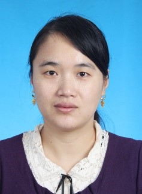

Professor Jianmei Luo
=========================

.. raw:: html

   
Jianmei Luo, PhD, Professor

   
Dean, Department of Pharmaceutical Engineering

   
College of Biotechnology, Tianjin University of Science and Technology, 

   
No. 29, St.No.13 Tianjin Econmic-Technological Development Area 

   
Tianjin 300457, P.R.China 

   
Tel.: +86-22-60601256; Fax: +86-22-60602298 

   
E-mail: luojianmei@tust.edu.cn

.. raw:: html

   

    
Jianmei luo was awarded a PhD degree on Chemical engineering and technolgy by ZheJiang University at 2005. After graduation, she came to work at Tianjin University of Science and Technology. She undertakes many undergraduate courses, including pharmaceutical technology, principles of medicine biosynthesis, technology experiment of pharmaceutical engineering and production practice. Her research interest involves in the strain screening, application and improvement of microorganisms with important values in industrial, medical and environmental fields, the cell physiological mechanism on stress and the cell tolerance regulation, the biocatalysis reactions and process control using the whole microbial cells as catalysts. Professor Luo is principal investigators of more than 10 projects, including National Natural Science Foundation of China, International Foundation for Science, the Natural Science Foundation of Tianjin, Tianjin City High School Science and Technology Fund Planning Project . Until now, she has more than 20 publications on SCI journals, including BIOSENS BIOELECTRON, BIORESOURCE TECHNOL, J AGR FOOD CHEM, APPL MICROBIOL BIOTECHNOL, and over 10 patents application or authorization. Professor luo has winned Tianjin Science and Technology Progress Awards (1 First Prize and 1 Second Prize). She is selected into the discipline Leading Talent Training program of Tianjin universities and granted as excellent advisor for engineering degree in Tianjin.

